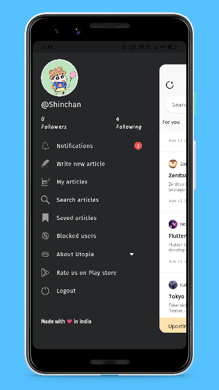
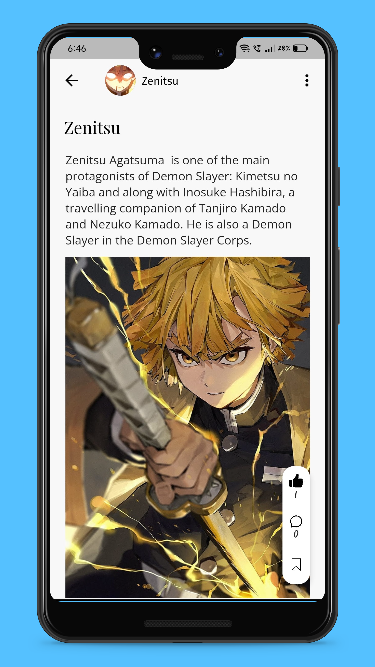
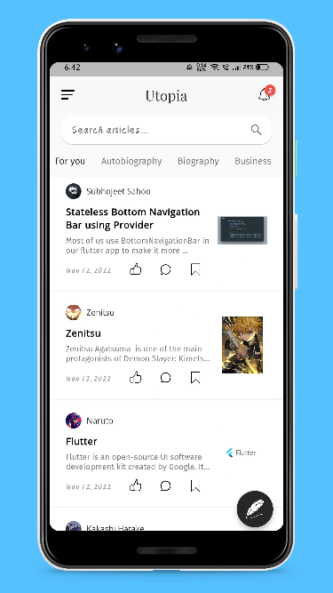

# Utopia
  

## Snaphots                                              
 |  |  |  |  |  |  

## License
```
Copyright © 2022 Utopia

Being Open Source doesn't mean you can just make a copy of the app and upload it on playstore or sell
a closed source copy of the same.
Read the following carefully:
1. Any copy of a software under GPL must be under same license. So you can't upload the app on a closed source
  app repository like PlayStore/AppStore without distributing the source code.
2. You can't sell any copied/modified version of the app under any "non-free" license.
   You must provide the copy with the original software or with instructions on how to obtain original software,
   should clearly state all changes, should clearly disclose full source code, should include same license
   and all copyrights should be retained.

In simple words, You can ONLY use the source code of this app for `Open Source` Project under `GPL v3.0` or later
with all your source code CLEARLY DISCLOSED on any code hosting platform like GitHub, with clear INSTRUCTIONS on
how to obtain the original software, should clearly STATE ALL CHANGES made and should RETAIN all copyrights.
Use of this software under any "non-free" license is NOT permitted.
```

## Requirements

* Dart sdk: ">=2.18.0
* [Flutter ">=3.3.1"](https://flutter.dev/docs/get-started/install)
* Android: minSdkVersion 23 and add support for androidx (see AndroidX Migration to migrate an existing app)

## Get Started

* Fork the the project
* Clone the repository to your local machine 
* Create and checkout a new branch (name of the branch should be meaningful)

## Running the project with Firebase

- Create a new project with the Firebase console.
- Add Android app in the Firebase project settings.
- On Android, use `com.utopia.prod` as the package name.
- then, [download and copy](https://firebase.google.com/docs/flutter/setup#configure_an_android_app) `google-services.json` into `android/app`.


See this document for full instructions:
- [https://firebase.google.com/docs/flutter/setup](https://firebase.google.com/docs/flutter/setup) 

## Setting up Firebase for backend services (Authentication , database and storage )

- Go to Firebase authentication section and enable Email/Password method for authentication
- Go to Firebase Realtime database and create a new database in test mode . Copy the API url and paste it into `lib/utils/constants.dart` . 
- Go to Firebase Firestore database and create a new database in test mode.
- Go to Firebase Firestore Storage and create a new database in test mode.

### Dont forget to :star: the repo
